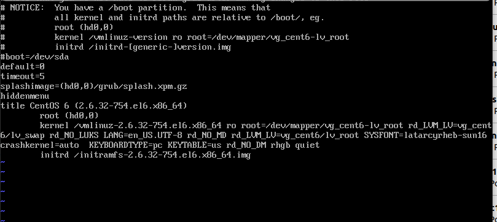
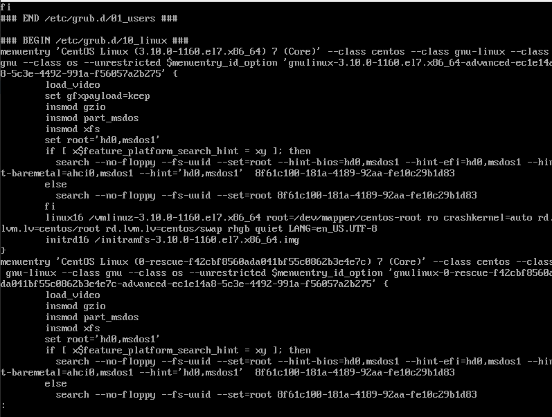

### Boot process overview
lets take a look at boot process and stick what ever we have learned till now:

```bash
BIOS / UEFI
    |
    Bootable Disk
        |
        Boot Loader(LILO,Grub,Grub2)
            |
            Kernel (initramfs/initd)
                |
                init --->systemd / upstart / SysV
                            |
                            everything---shell & other services and programs
```

if any problems occur on any of these steps, boot process fails. It might be motherboard problems, Disk problems or boot loader problem.lets start from very beginig.

### BIOS basic Input Output System vs UEFI(EFI) Unified Extensible Firmware Interface
When we start computer there should be away to wake up the kernel from sleep. But even our pour bootloader sleeps on the hard disk and has to access disk when no kernel driver is available. So there should be a hardware solution to access hard disk and starts boot loader and then bootloader wake up the kernel.
BIOS and UEFI are both interfaces for accessing disk.They sit between hardware/firmware and operating system and help computers to start. BIOS has become pretty old and UEFI has developed to retire it. UEFI has many advantages and has become default interface in modern PCs. UEFI is able to boot from large disks when we use GPT.

### MBR(Master Boot Record)
on BIOS system Master boot record is read from disk. MBR is not part of any file system and considered as metadata of your hard disk.How is it working ?Master boot record holds two things, some of or all of boot loader program and the partition table. At first stage just 446 kb of disk is read, (primary boot loader/IPL) and its job is to load second stage .as 512 bytes is so small to keep whole needed files to load the kernel, In second stage a MB of disk is read, which is meta data area of disk and every thing which is needed to load kernel should be exsited here. Boot loader(grub2) located in first 30 KB of hard disk immediately after MBR. grub load kernel and inintrd from /etc/boot/grub/grub.conf and loads other modules as needed. Grub loads GUI from /grub/splash.xpm.gz and starts the system.

```bash
root@server1:~# xxd -l 512 /dev/sda
00000000: eb63 9010 8ed0 bc00 b0b8 0000 8ed8 8ec0  .c..............
00000010: fbbe 007c bf00 06b9 0002 f3a4 ea21 0600  ...|.........!..
00000020: 00be be07 3804 750b 83c6 1081 fefe 0775  ....8.u........u
00000030: f3eb 16b4 02b0 01bb 007c b280 8a74 018b  .........|...t..
```

### GPT ( GUID Partition Table)
in UEFI system, GPT partition table is used. GPT partition table contains an EFI System Partition (ESP).Inside that there is always /efi directory. /efi directory might contains one or many boot loaders. Each boot loader has its own identifier and corresponding directory. So if you are using boot linux and microsoft windows, its usual to have both /efi/grub and /efi/microsoft directories.Boot loaders in this partition has .efi extension. So as you can see UEFI/EFIgive more flexibility and you can support more than one operating system by just having an ESP partition on a hard disk. no more pain :).

```bash
root@server3:~# gdisk  /dev/sda
GPT fdisk (gdisk) version 1.0.1
```
GPT is backward compatible and it has MBR .It is not used. it is MBR which is GPT compatible.

### MBR vs GPT
Lets compare these two:

|item|MBR|GPT|
|---|---|---|
|Number of Supported partitions|4|128 (modifiable )|
|Stored in|mbr (out side of file system)|GPT  partition|
|Partition Types|Primary, Logical, Extended|No more(Primary, logical, Extended)|
|Maximum Partition Size|2^64 * 512=2 T|2^64 * 512 =>hit file system limitations|
|Backup|no, nothing, easily damaged :(|store a backup at the end of disk|
|Work With|BIOS|UEFI and BIOS (Backward compatible)|

### Boot Loader Recovery General Notes
Recovering boot loader needs to specify three major required elements. We have already got familiar with all 3:
root partion
kernel and boot partition as its argument (usually same as root)
initrd/initramfs
how ever some commands are different in grub version 1 and version 2.

### Recovering Grub Legacy(CentOS6)

The default grub for centos6 is like bellow picture



grub version1 dosn't have "ls" command.Do not forget it starts counting hard disk partitions from "Zero".

```bash
grub>root ### if nothing showed up, we have to boot system by using another media

###2.Kernel, which kernel we want to boot from? nad where is the boot partition? consider lvm :(
grub> kernel /vmlinuz.x.y.z root=/dev/mspprt/vg_cent6-lv_root

###3.initramfs/initrd , Which initramdisk is going to be loaded? It should be the same as kernel version
grub>initrd /initrd-x.y.z

### and finally boot the system
grub>boot
```
after rebooting system install grub again:

```bash
[root@localhost ~]# grub-install /dev/sda
Installation finished. No error reported.
This is the contents of the device map /boot/grub/device.map.
Check if this is correct or not. If any of the lines is incorrect,
fix it and re-run the script `grub-install'.

# this device map was generated by anaconda
(hd0)     /dev/sda
```
### Recovering Grub2
Grub2 is more enhanced than legacy grab and if boot problems occur, grub might left system in different states.

|grub command prompt|Description| |
|---|---|---|
|grub>|prompt|GRUB 2 loaded modules but was unable to find the grub.cfg file. = has already found root partition|
|grub rescue>|prompt|GRUB 2 failed to find its grub folder, or failed to load the normal module. = has not found root partition|
|grub>:|The grub prompt on a blank screen|GRUB 2 has found the boot information but has been either unable to locate or unable to use an existing GRUB 2 configuration file (usually grub.cfg)|
|grub rescue>:|the rescue mode|GRUB 2 is unable to find the grub folder or its contents are missing/corrupted. The grub folder contains the GRUB 2 menu, modules and stored environmental data.|
|GRUB-|a single word, with no prompt and no curse|GRUB has failed to find even the most basic information, usually contained in the MBR or boot sector.|

Each failer might need different remedies here lets take a look at the first one. Grub2 supports "ls" , "cat" command and support tab tab completion. it starts counting partitions from "One" . Strange world huuh ?



```bash
###1.root, Finding root partition --- no "root command" in grub2
grub>ls ### to see partitions, (hdX,A) (hdX,B) (hdX,C) , ...
grub>ls (hdX,msdos1) ###try to guess based on content, setting root partition in grub 2 is different from grub 1
grub>set ###it show all current grub2 variables, we should check/create/fix two of them:
         ###prefix=(hdX,A)/boot/grub
         ###root=hdX,A
grub>set root=(hd0,msdos1) ###set/modify required variables base on information that we have got from ls
grub>set ###check results

###2.kernel, introducing kernel --- no "kernel command" in grub 2
grub>linux /vmlinux.x.y.z root=/dev/mapper/centos-root

###3.initramfs/initrd, give appropriate initramdisk for kernel , consider versions 
grub>initrd /initramfs-.x.y.z.img

###and finally
grub>boot
```

and finally do some post configuration :

```bash
grub2-mkconfig -o /etc/grub2.cfg

```

